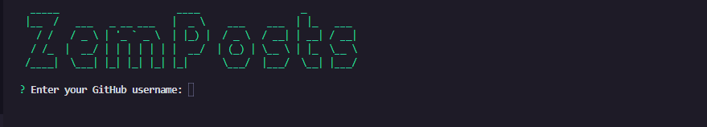
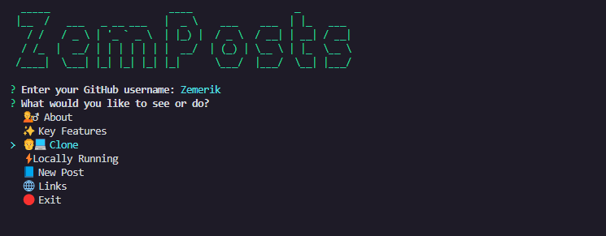
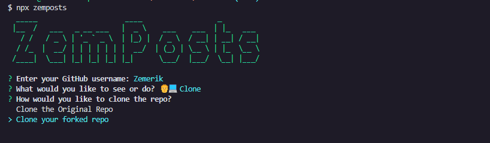
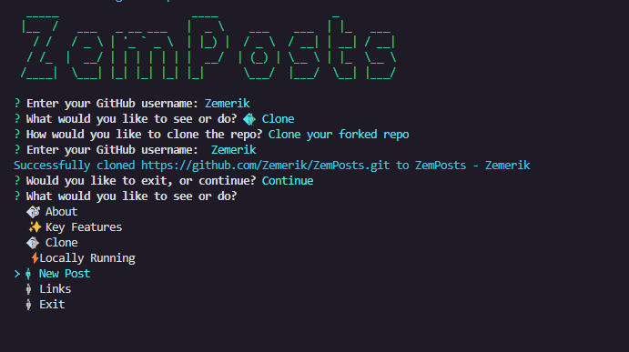
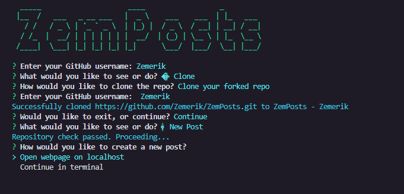

<p align = "center">


<br>

<br>


</p>

<h1 align = "center">
  ZemPosts
</h1>

<p align = "center">
  Post & Connect with Developers
</p>

<p align = "center">
  
</p

- [Package Link](https://www.npmjs.com/package/zemposts)

> [!Note]
> This CLI tool is currently in Beta. It is not fully complete and may contain bugs or issues. If you encounter any problems or need help, please open an [issue on the repository](https://github.com/Zemerik/ZemPosts). Your feedback is greatly appreciated and will help improve the tool for the final release.

## ⚡ Installation

1. Install the CLI via `NPM`:

```sh
npm i zemposts
```

2. Run the CLI via `NPX`:

```sh
npx zemposts
```

3. Enter your GitHub username when prompted.



## 💻 Commands:

You will be prompted a number of commands. Use your **Arrow Keys** to navigate between each option, and the **Enter** key to select a specific option. Below is an overview of each command:

<details close>

<summary>
1. Clone Repository:
</summary>

- Command: `👨‍💻 Clone`
- Description: This command allows users to clone either the original ZemPosts repository from GitHub or their forked version. This is useful for users who want to explore and understand ZemPosts.

</details>

<details close>

<summary>
2. Create a New Post:
</summary>

- Command: `📘 New Post`
- Description: Users can create a new blog post either via a local web interface (localhost) or directly in the terminal. This flexibility allows users to choose their preferred method for content creation.

</details>

<details close>

<summary>
3. Run Locally:
</summary>

- Command: `⚡Locally Running`
- Description: This command provides instructions for running the project locally. It checks if the repository is already cloned and, if not, guides the user through the cloning process and sets up the local environment.

</details>

<details close>

<summary>
4. About:
</summary>

- Command: `💁‍♂️ About`
- Description: Displays a brief overview of ZemPosts, including its purpose and key features. This helps users understand what ZemPosts is and what they can do with it.

</details>

<details close>

<summary>
5. Key Features:
</summary>

- Command: `✨ Key Features`
- Description: Lists the key features of ZemPosts, highlighting what makes the platform unique and useful for users.

</details>

<details close>

<summary>
6. Links:
</summary>

- Command: `🌐 Links`
- Description: Provides important links related to ZemPosts, including the GitHub repository, official website, and community support links.

</details>

<details close>

<summary>
7. Exit:
</summary>

- Command: `🔴 Exit`
- Description: Exits the CLI tool. Users can choose this option when they are done using the CLI.

</details>

## 🤝 Cloning:

> [!Caution]
> [Git](https://git-scm.com/) needs to be installed on your device!

You can easily clone either the original ZemPosts Repository or your forked version through our CLI.

1. Select the `👨‍💻 Clone` option and press `Enter`:



2. You will now be prompted to clone either the original repository or your forked version. Use your **Arrow Keys** to choose, and press **Enter** to select:

> [!Tip]
> To clone your forked version, you need to first fork a copy of this repository on your github account. Click [here](https://github.com/Zemerik/ZemPosts/fork) to do so.



3. A repository will automatically be cloned.

- If you cloned the original repository, the destination will be `ZemPosts - Zemerik`
- if you cloned your forked version, the destination will be `ZemPosts - [Your Github Username]`

## ➕ Adding your Post:

> [!Caution]
> You must have cloned your forked version of this repository. Refer to `Cloning` section for assistance.

1. Use your arrow keys to select the `📘 New Post` option:



2. You will then be prompted to either continue in the terminal or open a webpage on localhost. Use your **Arrow Keys** to choose and press **Enter** to select

- You will be asked to enter different information such as your Post Title, and Publication Date. Fill out all the required information as this will be showed on the website!



3. After you have entered all the required information and submitted, a file would automatically created in the `ZemPosts - [Your Github Username]/src/content/blog` directory with the same title as your post title. 

- If necessary, make any changes. 

4. After you are happy with your post (remember to check for spelling and grammar mistakes), use `git` to commit and push:

```sh
cd ZemPosts - [Your Github Username]

git add .

git commit -m "New Post: ..."

git push -u origin main
```

5. Open a [Pull-Request](https://github.com/Zemerik/ZemPosts/pulls) on this repository!

> Your PR will be **merged**/**reviewed** as soon as possible!

## 🤖 Other Commands:

- The remaining commands are straightforward and should be easy to use without additional instructions. If you need help with any specific command, please feel free to open an [issue](https://github.com/Zemerik/ZemPosts/issues) for detailed instructions.

## 💁 Support:

For any kind of support or inforrmation, you are free to join our **Discord Server**,

<a href = "https://discord.gg/UF9KsmuGbr">
  
</a>

<h1 align = "center">
  Thanks for Visiting🙏
</h1>

<p align = "center">
  Don't forget to leave a ⭐ 
  <br>
  Made with 💖 by <a href = "https://github.com/Zemerik">Hemang Yadav (Zemerik)</a>
</p>
