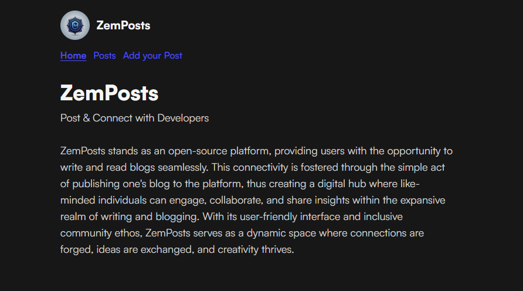

<p align = "center">


<br>

<br>


</p>

<h1 align = "center">
  ZemPosts
</h1>

<p align = "center">
  Post & Connect with Developers
</p>

<p align = "center">
  
</p>

## ❗ About:

ZemPosts stands as an open-source platform, providing users with the opportunity to write and read blogs seamlessly. This connectivity is fostered through the simple act of publishing one's blog to the platform, thus creating a digital hub where like-minded individuals can engage, collaborate, and share insights within the expansive realm of writing and blogging. With its user-friendly interface and inclusive community ethos, ZemPosts serves as a dynamic space where connections are forged, ideas are exchanged, and creativity thrives.

- Read our Official Docs on [ZemDocs](https://zemdocs.vercel.app/en/zemposts/introduction)

## 🎥 Youtube Video:

- Feel free to watch our Youtube Video by clicking below 👇

<div align = "center">

[](https://www.youtube.com/watch?v=1HVd3NTt3f8)

</div>

## ⭐ Features:

<table align = "center">
  <tr>
    <td>
      <br>
      <p align = "center">
        📱 Responsive UI Design supported on all devices
      </p>
      <br>
      <br>
      <p align = "center">
        📃 Write Blogs using Markdown
      </p>
      <br>
      <br>
      <p align = "center">
        💖 Read other People's Blogs
      </p>
      <br>
      <br>
      <p align = "center">
        🏆 Open Source
      </p>
    </td>
    <td>

  
    </td>
  </tr>
  <tr>
    <td>
      <p align = "left">
       ▶️ Want to Add More Features?
      </p>
    </td>
    <td>
      <p align = "center">
       Open an <a href = "https://github.com/Zemerik/ZemPosts/issues">Issue</a> and let us know! ◀
      </p>
    </td>
  </tr>
</table>

## 🏃‍♂️ Locally Running:

- This project can be locally executed on your machine in 4 simple steps!

> [!Tip]
> [NodeJS](https://nodejs.org/) needs to be installed on your machine. 


1. Make a `Copy` of this Repository on your machine by using the following `git command` in your terminal:

```
git clone https://github.com/Zemerik/ZemPosts
```

2. `Navigate` into the Project's `directory` by entering the following `command` in your terminal:

```
cd ZemPosts
```

3. `Install` the required `Dependencies` by using `NPM`:

```nodejs
npm i
```

4. Start the `Development Server` through the following `command`:

```nodejs
npm run astro dev
```

## 🚀 Project Structure

```text
├── public/
│   ├── fonts/
│   └── images/
├── src/
│   ├── components/
│   ├── content/
│   ├── layouts/
│   └── pages/
│   └── styles/
│   └── util/
├── astro.config.mjs
├── README.md
├── CODE_OF_CONDUCT.md
├── CONTRIBUTING.md
├── SECURITY.md
├── Licence
├── package.json
├── package-lock.json
├── bun.lockb
├── unoconfig.ts
└── tsconfig.json
```

## 🤝 Contributing:

Contributions are always welcome and appreciated! **Kindly visit the [CONTRIBUTING.md](https://github.com/Zemerik/ZemPosts/blob/main/CONTRIBUTING.md) file for more information**

- > Don't Forget to Checkout [ZemProfiles](https://github.com/Zemerik/ZemProfiles) & [ZemShowcase](https://github.com/Zemerik/ZemShowcase)
  
## 💁 Support:

For any kind of support or inforrmation, you are free to join our **Discord Server**,

<a href = "https://discord.gg/UF9KsmuGbr">
  
</a>

## 🥳 Contributors:

Thanks to all Contributors!


<h1 align = "center">
  Thanks for Visiting🙏
</h1>

<p align = "center">
  Don't forget to leave a ⭐
  <br>
  Made with 💖 by <a href = "https://github.com/Zemerik">Hemang Yadav (Zemerik)</a>
</p>
